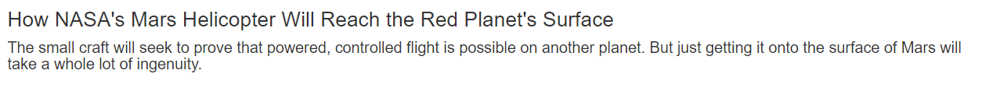
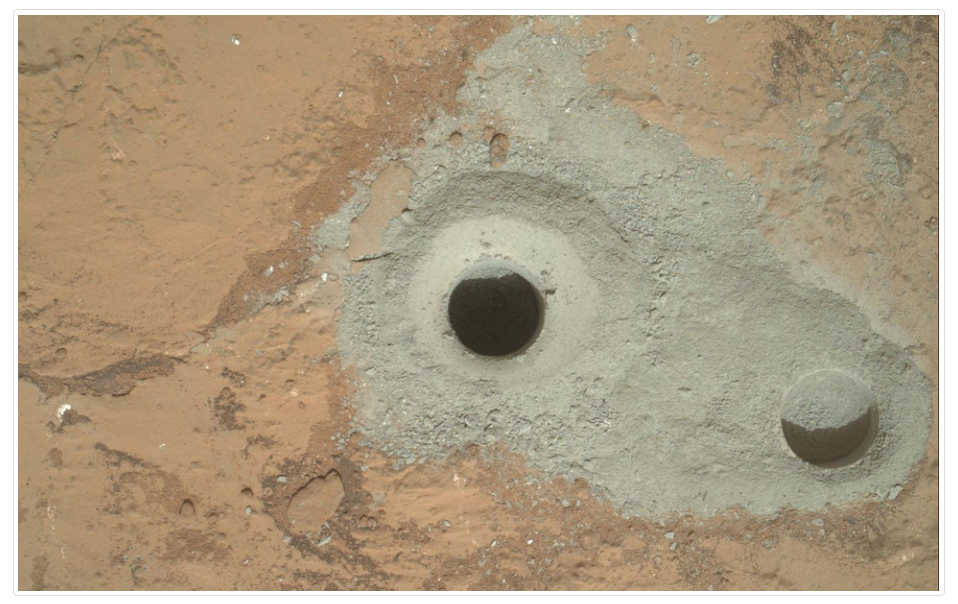
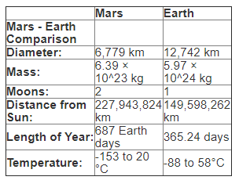
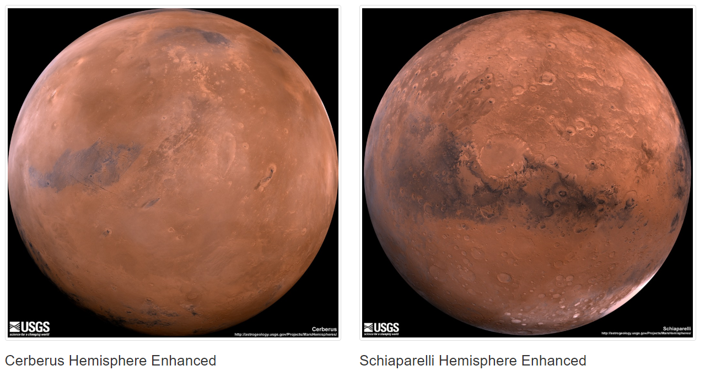

# Web Scraping - Mission to Mars

Built a web application that scrapes various websites for data related to the Mission to Mars and displays the information in a single HTML page.

# Scraping

Scraping occurs using Jupyter Notebook, BeautifulSoup, Pandas, and Requests/Splinter.

* Created a Jupyter Notebook file and used this to complete all scraping and analysis tasks. The following outlines what is scraped by the file.

## NASA Mars News

* Application scrapes the [NASA Mars News Site](https://mars.nasa.gov/news/) and collects the latest News Title and Paragraph Text. Assigns the text to variables to be referenced later.

## JPL Mars Space Images - Featured Image

* The application visits the url for JPL Featured Space Image [here](https://www.jpl.nasa.gov/spaceimages/?search=&category=Mars).

* Uses splinter to navigate the site and find the image url for the current Featured Mars Image and assigns the url string to a variable called `featured_image_url`.

* Saves a complete url string for this image.

## Mars Facts

* Visits the Mars Facts webpage [here](https://space-facts.com/mars/) and uses Pandas to scrape the table containing facts about the planet including Diameter, Mass, etc.

* Uses Pandas to convert the data to a HTML table string.

## Mars Hemispheres

* Visits the USGS Astrogeology site [here](https://astrogeology.usgs.gov/search/results?q=hemisphere+enhanced&k1=target&v1=Mars) to obtain high resolution images for each of Mar's hemispheres.

* Saves both the image url string for the full resolution hemisphere image, and the Hemisphere title containing the hemisphere name. Uses a Python dictionary to store the data using the keys `img_url` and `title`.

* Appends the dictionary with the image url string and the hemisphere title to a list which contains one dictionary for each hemisphere.

## MongoDB and Flask Application

Used MongoDB with Flask templating to create a new HTML page that displays all of the information that was scraped from the URLs above.

Below is the head of the landing page where the page can be updated by clicking "Scrape New Data".

All images above with the exception of the first are snipped from the web page created below.

* Converted Jupyter notebook into a Python script called `scrape_mars.py` with a function called `scrape` that will execute all scraping code from above and return one Python dictionary containing all of the scraped data.

* Created a route called `/scrape` that will import `scrape_mars.py` script and call `scrape` function.

  * Application stores the return value in Mongo as a Python dictionary.

* Created a root route `/` that queries Mongo database and passes the mars data into an HTML template to display the data.

* Created a template HTML file called `index.html` that takes the mars data dictionary and displays all of the data in the appropriate HTML elements. 